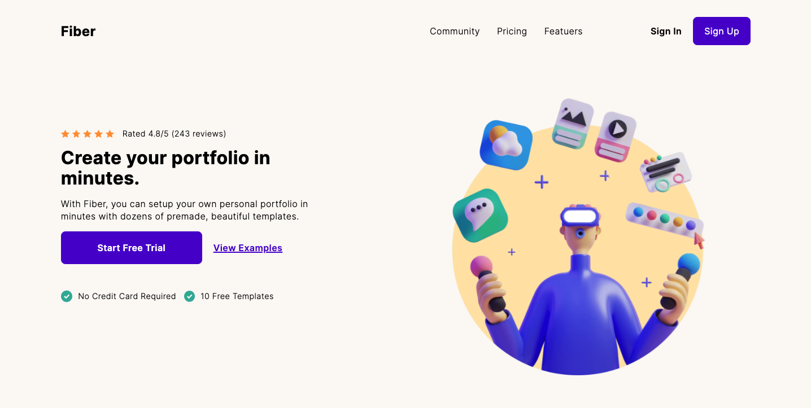

# Fiber Landing Page

This is a solution to the [Fiber Landing Page challenge on Codewell](https://www.codewell.cc/challenges/608a7e639691700015db16d1). Codewell challenges help improve your HTML and CSS skills by practicing on real design templates.

## Table of contents

- [Overview](#overview)
  - [The challenge](#the-challenge)
  - [Screenshot](#screenshot)
  - [Links](#links)
- [My process](#my-process)
  - [Built with](#built-with)
  - [What I learned](#what-i-learned)
  - [Continued development](#continued-development)
- [Author](#author)
- [Acknowledgments](#acknowledgments)

## Overview

### The challenge

Take the design and build a landing page for an online portfolio generator. Great to practice flex/grid layouts, absolute positioning and sliders.

### Screenshot



### Links

- Github Repo: [Add solution URL here](https://github.com/IsaacArnold/fiber-landing-page-two)
- Live Site: [Add live site URL here](https://fiberlandingpage123.netlify.app/)

## My process

### Built with

- GatsbyJS
- SCSS
- Flexbox
- CSS Grid
- Mobile-first workflow
- Netlify to host contact form

### What I learned

This challenge was a great way to cement my Gatsby knowledge. Using pages to create the 'Sign Up' and 'Contact' pages, I was able to enable the user to easily navigate between pages.

The biggest challenge in this project was getting the purple section to closely match the mockup files. In the end I settled on an empty div and used a background-image to insert the image.

One particular aspect of this project I am proud of was my ability to quickly set up a Netlify contact form. This was my first time trying to implement a form and thanks to Netlify's easy integration with Gatsby, this couldn't have been easier. The form also features a honeypot field to prevent spam. Please see the form code below:

```jsx
<form
  name="Contact Form"
  method="POST"
  onSubmit="submit"
  netlify-honeypot="bot-field"
  data-netlify="true"
  action="/success"
>
  <input type="hidden" name="form-name" value="Contact Form" />
  <input
    type="hidden"
    name="subject"
    value="Fiber has a new contact message."
  />
  <div className="form-section">
    <label htmlFor="fullName">Full Name</label>
    <input
      type="text"
      name="fullName"
      id="fullName"
      placeholder="John Doe"
      required="{true}"
    />
  </div>
  <div className="form-section">
    <label htmlFor="email">Your Email:</label>
    <input
      type="email"
      name="email"
      id="email"
      placeholder="john@example.com"
      required="{true}"
    />
  </div>
  <div className="form-section">
    <label htmlFor="message">Message:</label>
    <textarea
      name="message"
      id="message"
      placeholder="Type your message here..."
      required="{true}"
    />
  </div>
  <button type="submit">Send</button>
</form>
```

### Continued development

I'd like to continue developing my Gatsby skills. Particularly in the areas of:

- Layout
- SEO implementation

## Local Development

If you'd like to download or clone this project to develop locally on your own machine, just follow these steps:

1. Download or clone this repo
2. Ensure Gatsby is installed on your machine. You can find out more [here](https://www.gatsbyjs.com/docs/quick-start/)
3. In your terminal, navigate to the project directory
4. Once in the project directory, simply run `gatsby develop`
5. Open up [](http://localhost:8000)

## Author

- Website - [Isaac Arnold](https://isaacarnold.dev/)
- Instagram - [@isaac.codes](https://www.instagram.com/isaac.codes/)
- Twitter - [@isaac_codes](https://twitter.com/isaac_codes)

## Acknowledgments

I'd particularly like to acknowledge Codewell for the high quality design mockups and collateral provided to complete this challenge. Go check them out [here](https://www.codewell.cc/)
